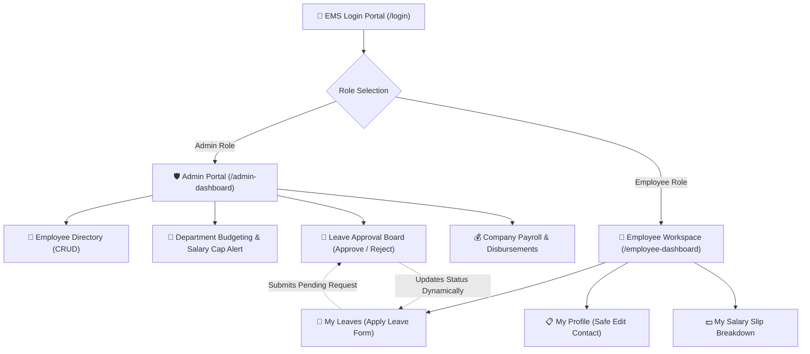

<div align="center">

  # ⚡ WorkPulse EMS
  ### Modern Full-Stack Employee Management System
  
  [](https://reactjs.org/)
  [](https://vitejs.dev/)
  [](https://tailwindcss.com/)
  [](https://expressjs.com/)
  [](https://nodejs.org/)
  [](https://rvu.edu.in)

  <p align="center">
    <b>A production-grade full-stack web application built for CS3301 – Full Stack Development CIE-2 React Mini Project.</b><br />
    Includes complete Role-Based Access Control (RBAC), live department budget salary cap alerts, and an integrated employee self-service portal.
  </p>

</div>

---

> [!IMPORTANT]
> **Database-Free Architecture:** This application stores all data dynamically using in-memory JavaScript data structures inside the Express backend (`backend/server.js`) without external databases (No MongoDB, No SQL, No Supabase), adhering strictly to CS3301 project constraints.

---

## 🌟 Key Features

| Feature Module | Admin Access Role 🛡️ | Employee Access Role 👤 |
| :--- | :--- | :--- |
| **Authentication & Role Toggle** | Access Admin Dashboard (`/admin-dashboard`) | Access Employee Workspace (`/employee-dashboard`) |
| **Workforce Directory** | Full CRUD (Add, Edit, Delete, Search, Filter) | View Own Profile & Update Safe Contact Info |
| **Department Management** | View budget allocations & Salary Cap Alerts | View Own Department details |
| **Leave Management** | Approve or Reject applications with dynamic filter tabs | Apply for Leave & track status in real-time |
| **Payroll & Compensation** | Company-wide payroll summary & disbursement view | Individual Payslip breakdown (Basic, Allowances, Deductions) |

---

## 🏗️ System Architecture & Role Flow



---

## 🚀 Modifications Made Beyond YouTube Tutorial

> **Reference Inspiration:** *MERN Stack Employee Management System – Project Overview & File Structure (Part 1)* by **Code With Yousaf** ([YouTube Video](https://youtu.be/P_L-06VRcBI?si=-vIy8FhUseQ4yG0r))

Beyond the foundational tutorial concept, this application incorporates **three major documented enhancements**:

### 1️⃣ Modification 1: Role-Based Employee Self-Service Portal & API Filtering
- **Tutorial Base:** Reference tutorial projects primarily feature single-view Admin management panels where all logged-in accounts access administrative controls and employee lists.
- **Our Implementation:**
  - **Complete UI Separation:** Employees receive a dedicated workspace (`/employee-dashboard`, `/employee-profile`, `/my-leaves`, `/my-salary`). They cannot access or view other employees' records or salary figures.
  - **API-Level Filtering:** Dedicated Express endpoints (`/api/leaves/my/:id`, `/api/salary/my/:id`) filter data server-side.
  - **Synchronized Workflow:** Employee leave applications appear as `Pending` on the Admin Leave page. When an Admin clicks `Approve` or `Reject`, the status updates dynamically on the employee's portal in real-time.

### 2️⃣ Modification 2: Department Salary Cap Alert System
- **Location:** `src/pages/Departments.jsx` (API: `GET /api/departments`)
- **Our Implementation:** The Express server dynamically sums all employee salaries in each department. If `totalSalary > salaryCap`, a dynamic warning alert is rendered:
  > `⚠ Salary Cap Exceeded: This department has exceeded the allocated salary limit by ₹[Amount].`

### 3️⃣ Modification 3: Interactive Status Filter Tabs with Live Counters
- **Location:** `src/pages/Leaves.jsx`
- **Our Implementation:** Interactive status filter tabs (`All`, `Pending`, `Approved`, `Rejected`) featuring live badge counters computed from state (`All (8)`, `Pending (3)`, `Approved (3)`, `Rejected (2)`).

---

## 🔑 Demo Accounts for Presentation / Testing

The Login screen includes **1-Click Quick Fill Buttons** for instant evaluation:

| Account Role | Email Credentials | Password | Default Redirect |
| :--- | :--- | :--- | :--- |
| **Administrator** | `admin@ems.local` | `admin123` | `/admin-dashboard` |
| **Employee (Rahul Sharma)** | `rahul@ems.local` | `employee123` | `/employee-dashboard` |
| **Employee (Sneha Nair)** | `sneha@ems.local` | `employee123` | `/employee-dashboard` |

---

## 📡 REST API Specifications

The Express backend server runs on `http://localhost:5000/api`:

| Method | Endpoint | Role | Description |
| :--- | :--- | :--- | :--- |
| `POST` | `/api/login` | Public | Authenticates user and returns role payload |
| `GET` | `/api/stats` | Admin | Aggregated metrics for dashboard stat cards |
| `GET` | `/api/employees` | Admin | Retrieves all employee directory records |
| `POST` | `/api/employees` | Admin | Creates a new employee record & user account |
| `PUT` | `/api/employees/:id` | Admin | Updates employee profile |
| `DELETE`| `/api/employees/:id` | Admin | Removes employee record & associated data |
| `GET` | `/api/departments` | Admin | Retrieves departments with dynamic salary sum & cap alert |
| `POST` | `/api/departments` | Admin | Adds a new department unit |
| `GET` | `/api/leaves` | Admin | Retrieves all leave requests |
| `GET` | `/api/leaves/my/:id` | Employee | Retrieves **ONLY** logged-in employee's leave history |
| `POST` | `/api/leaves` | Employee | Submits a new leave application (`status: Pending`) |
| `PUT` | `/api/leaves/:id` | Admin | Approves or rejects pending leave application |
| `GET` | `/api/salary` | Admin | Retrieves company-wide payroll summary |
| `GET` | `/api/salary/my/:id` | Employee | Retrieves **ONLY** logged-in employee's salary breakdown |

---

## 📁 Folder Structure

```text
D:\FSD_ClassSem5\Employee-Mgt-System\
├── backend/
│   ├── package.json
│   ├── server.js             # Express REST API & In-Memory Data Arrays
│   └── README.md
├── frontend/
│   ├── package.json
│   ├── vite.config.js        # Vite Config
│   ├── tailwind.config.js    # Tailwind Config
│   └── src/
│       ├── components/
│       │   ├── Navbar.jsx            # Header & Clickable Profile Pill
│       │   ├── Sidebar.jsx           # Role-based Navigation Sidebar
│       │   ├── ProtectedRoute.jsx    # Role Security Guard
│       │   ├── StatCard.jsx          # Reusable Metric Card
│       │   ├── EmployeeCard.jsx      # Reusable Employee Card
│       │   ├── LeaveTable.jsx        # Reusable Leave Table
│       │   ├── FormInput.jsx         # Controlled Input with Error Styling
│       │   ├── StatusBadge.jsx       # Color Badge Indicator
│       │   ├── Modal.jsx             # Reusable Dialog Overlay
│       │   └── ErrorBoundary.jsx     # [CLASS COMPONENT] Error Boundary
│       ├── pages/
│       │   ├── Login.jsx             # Simulated Role Login (/login)
│       │   ├── AdminDashboard.jsx    # Executive Metrics (/admin-dashboard)
│       │   ├── AdminProfile.jsx      # Admin Profile (/admin-profile)
│       │   ├── Employees.jsx         # Employee Directory CRUD (/employees)
│       │   ├── Departments.jsx       # Department Salary Cap Alert (/departments)
│       │   ├── Leaves.jsx            # Admin Leave Processing (/leaves)
│       │   ├── Salary.jsx            # Admin Payroll Breakdown (/salary)
│       │   ├── EmployeeDashboard.jsx # Employee Workspace (/employee-dashboard)
│       │   ├── EmployeeProfile.jsx   # Employee Profile (/employee-profile)
│       │   ├── MyLeaves.jsx          # Employee Personal Leaves (/my-leaves)
│       │   └── MySalary.jsx          # Employee Personal Salary (/my-salary)
│       ├── api.js                    # Fetch REST API Wrapper
│       ├── App.jsx                   # Router & LocalStorage Persistence
│       └── main.jsx                  # React Root Entrypoint
├── PROJECT_REPORT.md                 # Complete RV University Project Report
└── README.md                         # Project Documentation
```

---

## ⚙️ Installation & Local Setup Guide

### 1. Clone the Repository
```bash
git clone https://github.com/YOUR_USERNAME/Employee-Mgt-System.git
cd Employee-Mgt-System
```

### 2. Start Express Backend
```bash
cd backend
npm install
node server.js
```
> Express backend starts on `http://localhost:5000`

### 3. Start React Frontend
Open a second terminal window:
```bash
cd frontend
npm install
npm run dev
```
> React Vite frontend starts on `http://localhost:5173`

---

## 🛠️ Required React Concepts Checklist

- [x] **Class Component:** `src/components/ErrorBoundary.jsx` (`class ErrorBoundary extends React.Component`)
- [x] **Reusable Components:** `StatCard`, `EmployeeCard`, `LeaveTable`, `FormInput`, `StatusBadge`, `Modal`
- [x] **Parent-Child Props:** `Employees` $\rightarrow$ `EmployeeCard`, `Leaves` $\rightarrow$ `LeaveTable`
- [x] **`useState` Hook:** Controlled forms, search filter, modal visibility, role state
- [x] **`useEffect` Hook:** Triggering REST API fetch calls on component mount
- [x] **Form Validation:** Input validation rules with red border alerts & error messages
- [x] **Client-side Routing:** React Router DOM v6 with `ProtectedRoute` guards
- [x] **Responsive UI:** Tailwind CSS grid/flex utilities with collapsible mobile drawer

---

## 🤝 Acknowledgements & References

- **Reference Tutorial:** *MERN Stack Employee Management System – Project Overview - by Code With Yousaf ([YouTube Video](https://youtu.be/P_L-06VRcBI?si=-vIy8FhUseQ4yG0r))
- **Institution:** School of Computer Science and Engineering, RV University, Bengaluru.

---

<div align="center">
  <sub>Developed for CS3301 Full Stack Development Mini Project (2025–2026).</sub>
</div>
